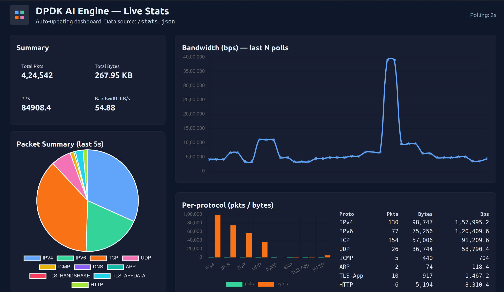
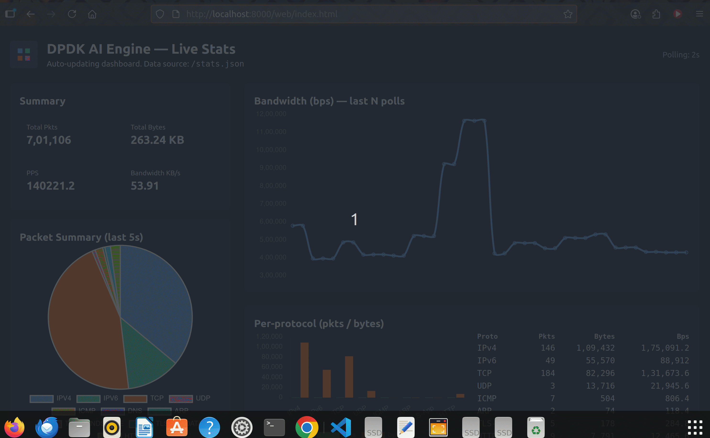
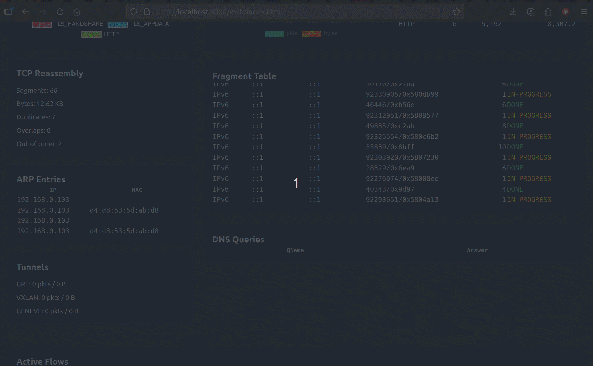
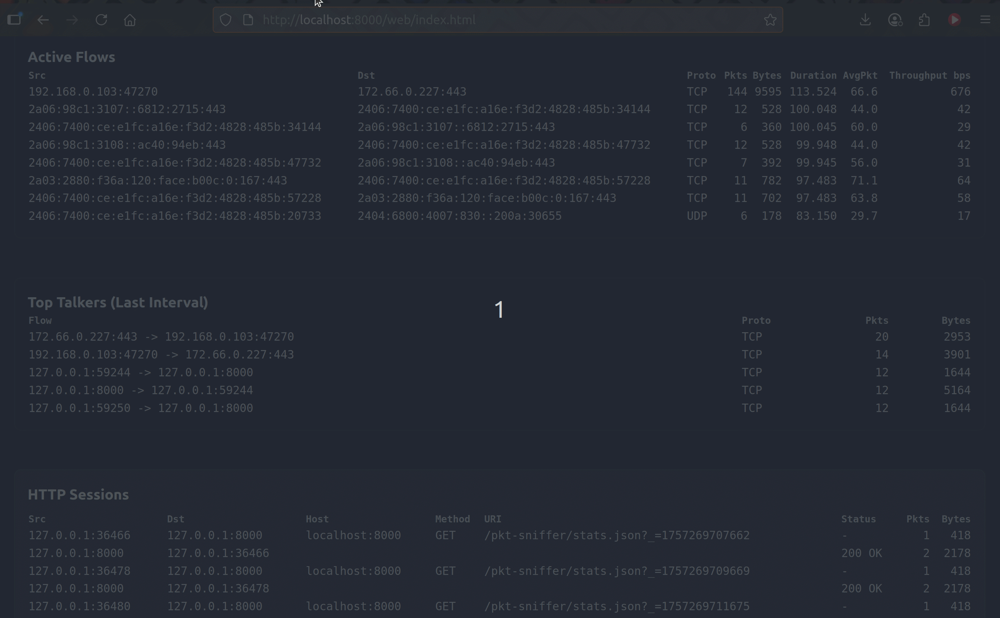

# 🚀 ⚡ DPDK AI ENGINE: Ultra-Low Latency Packet Analytics with DPDK & AI 🚀

`DPDK-AI-Engine` is a **blazing-fast packet analytics framework** designed for environments where **microseconds matter**.
It combines **DPDK’s zero-copy packet capture** with an **AI-ready analytics engine**, enabling deep insights into live traffic at **line rate**.

Think of it as **tcpdump on steroids** — flow-aware, protocol-smart, and ready for machine learning.

---



---

## 🚀 Demo

Here’s a quick look at the dashboard and live parser logs in action:

<table>
  <tr>
    <td align="center"><b>📊 Dashboard (Top)</b><br>
      
    </td>
    <td align="center"><b>📈 Dashboard (Middle)</b><br>
      
    </td>
  </tr>
  <tr>
    <td align="center"><b>📉 Dashboard (Bottom)</b><br>
      
    </td>
    <td align="center"><b>📝 Live Parser Logs</b><br>
      
    </td>
  </tr>
</table>

---

## ✨ Features

✅ **Capture Modes**

* **DPDK mode** for ultra-low latency (nanosecond precision).
* **AF\_PACKET/PCAP mode** for development & testing.

✅ **Real-Time Analytics**

* Per-protocol bandwidth and packet counters.
* Flow-based stats (duration, throughput, avg pkt size).
* TCP reassembly with application-layer visibility.

✅ **Protocol Decoders**

* IPv4 / IPv6 / ARP / ICMP / UDP / TCP
* DNS, DHCP, HTTP (with request/response tracking)
* TLS handshakes (basic fingerprinting)

✅ **Flow Management**

* Automatic flow tracking and expiration.
* Bidirectional support for accurate session analysis.

✅ **Extensible & AI-Ready**

* Structured output for ML pipelines.
* Hooks for anomaly detection, feature extraction, and predictive models.

---

## 🏗️ Architecture Overview

```
            ┌──────────────┐
            │   NIC / DPDK │
            └───────┬──────┘
                    │ packets (10G/40G/100G)
            ┌───────▼─────────┐
            │  Packet Capture │   (DPDK / AF_PACKET / PCAP)
            └───────┬─────────┘
                    │
            ┌───────▼─────────┐
            │  Parser & Stats │   (L2/L3/L4 decoders, flow tracking,
            │                 │    TCP reassembly, drops/errors)
            └───────┬─────────┘
                    │
    ┌───────────────▼───────────────┐
    │   Analytics & AI Integration   │  (anomaly detection, ML features,
    │                                │   predictive models)
    └───────────────┬───────────────┘
                    │
            ┌───────▼─────────┐
            │  Output / UI    │   (console, JSON, Grafana, custom UI)
            └─────────────────┘
```

* Data Sources: Market feeds, sensors, APIs, etc.
* DPDK Packet Capture: Ultra-fast, zero-copy packet ingestion.
* TCP/IP Reassembly: Handles fragmented packets & ensures reliable analysis.
* AI Prediction: Modular ML/Deep Learning models.
* Dashboard/Storage: Real-time visualization or database storage.

---

## 🚀 Use Cases

* **Finance** – monitor exchange feeds & trading flows with nanosecond precision.
* **Security** – detect anomalies, intrusions, and encrypted traffic patterns.
* **Cloud & Telco** – real-time observability of tunnels, VXLAN/GENEVE overlays (roadmap).
* **Research** – generate datasets for ML models in networking & cybersecurity.

---

## 📍 Roadmap

🔹 Tunneling protocols (GRE, VXLAN, GENEVE)
🔹 Drop/error/malformed packet tracking (#35)
🔹 More protocol parsers (MQTT, QUIC, gRPC, FIX)
🔹 Inline ML model inference ( anomaly detection, classification )
🔹 Web-based UI & dashboards

See full roadmap here: [docs/ROADMAP.md](docs/ROADMAP.md)

---

## 🏁 Quick Start

### Prerequisites

Dependencies:
Make sure the following libraries are installed on your system:

* Meson
* Ninja
* libpcap
* DPDK (if using DPDK environment)
* Standard build tools (gcc/clang, pkg-config, make)

```bash
sudo apt update
sudo apt install -y meson ninja-build build-essential pkg-config \
    libpcap-dev

# For DPDK (optional, for high-speed packet capture)
sudo apt install -y dpdk dpdk-dev
```

### Build

```bash
# Configure
meson setup build

# Compile
ninja -C build
```

---

## 📊 Sample Output

### Flow Stats

```
Flow: 192.168.0.104:40498 -> 13.89.179.8:443
  Proto: TCP    Pkts: 10     Bytes: 3288    
  Duration: 1.188 s    AvgPkt: 328.8 B  Throughput: 22.15 Kbps
```

### TCP Reassembly

```
=== TCP Reassembly Stats ===
Segments received    : 26
Bytes delivered      : 5378
Duplicate segments   : 9
Out-of-order segments: 0
```

---

## 🤝 Contributing

Pull requests are welcome! Check the TODO.md for active stories & open features.
We’re building this as a modular, community-driven project for next-gen packet analytics.

---

## 📜 License

Apache 2.0 – free to use, modify, and extend.
