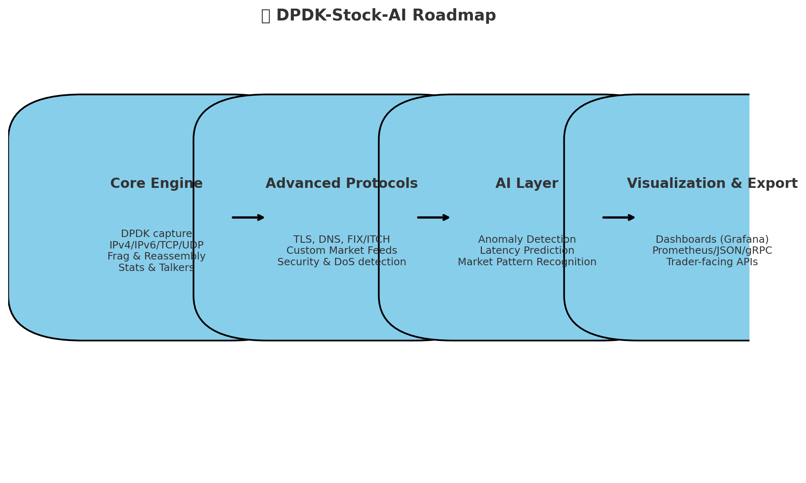

📡 DPDK-Stock-AI — Vision

🌍 What We’re Building

DPDK-Stock-AI is not “just another packet sniffer.”
It is a next-generation, ultra-low-latency analytics engine designed for financial markets and AI-driven decision-making.

At its core, it combines:

 - DPDK-powered packet capture for millions of packets per second
 - Deep protocol parsing (market data, FIX/ITCH, TCP/IP, DNS, TLS, etc.)
 - Real-time statistics, top talkers, latency profiling
 - AI-driven insights (pattern recognition, anomaly detection, predictive analytics)
 - Modern visualization & export (Grafana, Prometheus, JSON, gRPC)

🚀 Why It Matters

Financial trading is all about speed and intelligence:

 - Every microsecond counts.
 - Every packet carries signal.
 - Every anomaly could cost millions.
 
Existing tools either:

 - Analyze deeply (Wireshark) but are too slow.
 - Process fast (raw DPDK apps) but lack visibility and AI.

👉 We are merging both worlds:

High-performance packet capture + full protocol intelligence + AI-driven predictions.

🏆 The Vision

By the time we complete our roadmap, we will have:

 - Wireshark-grade protocol analysis
 - Exchange-grade packet engine capable of millions of packets/sec
 - Security & resilience features (DoS detection, anomaly tracking, reassembly)
 - AI-powered forecasting and anomaly detection for stock market feeds
 - Rich dashboards and APIs for real-time operations

💡 In short:

A stock-market AI operating system built on packets.

🔮 What’s Next

 - Complete core packet engine (IPv4, IPv6, TCP/UDP/ICMP, frag/reassembly)
 - Add financial protocol parsing (FIX, ITCH, proprietary feeds)
 - Introduce AI/ML models for flow prediction & anomaly detection
 - Scale to multi-core, multi-node deployments
 - Deliver real-time dashboards for traders, researchers, and infra teams

## Milestones

| Phase | Focus Areas |
|-------|-------------|
| MVP (v0.1) | Core packet parsing, stats, talkers |
| Phase 2 (v0.2) | Advanced protocols, frag/reassembly, latency |
| Phase 3 (v0.5) | AI/ML analytics (anomaly detection, prediction) |
| Phase 4 (v1.0) | Integrations & dashboards (Grafana, Kafka, REST API) |
| Future | Security enhancements, LLM analysis, cluster mode |

##  Contributing & Roadmap
We manage tasks and roadmap via GitHub Projects:
[📡 Project Board – Backlog & Priorities](https://github.com/users/ramangupta/projects/1)

🌟 Our Mission

To build the fastest, smartest, most insightful open-source packet engine for financial markets — a project where low-level performance meets high-level intelligence.